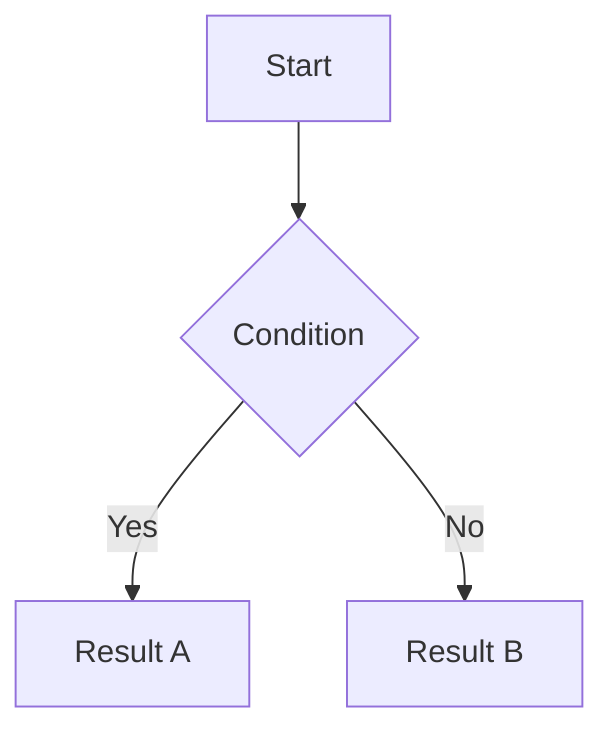

# Orz Markdown

A VS Code extension for editing and previewing **`.md.html`** files — a self-contained document format that is simultaneously valid Markdown source and a fully standalone HTML web page.

## The `.md.html` Format

A `.md.html` file is an ordinary HTML file that can be opened in any browser without any tooling. The markdown source is embedded in a hidden `<script type="text/markdown">` block inside the HTML body. When you open the file in VS Code, the extension extracts the markdown for editing and re-renders it back on save. All theme CSS and library scripts (KaTeX, Mermaid, highlight.js, SmilesDrawer) are referenced in the file so no local server or internet connection is needed to view the published file.

## Features

- **Split-pane editing** — Markdown editor on the left, live HTML preview on the right
- **Live preview** — Preview updates as you type (debounced, scroll position preserved)
- **10 built-in themes** — Dark and light themes, persisted per file
- **Font scale control** — Increase or decrease preview font size
- **Standalone HTML output** — Saved files open in any browser, no extensions required
- **Offline-safe preview** — Vendor libraries bundled with the extension; preview works without internet
- **VS Code restart recovery** — Open files and preview panels are restored on VS Code restart
- **Rich markdown** — Math, diagrams, chemistry structures, syntax highlighting, and more

## Installation

Install from the VSIX file:

```
code --install-extension orz-md-vscode-0.1.0.vsix
```

Or via the VS Code command palette: **Extensions: Install from VSIX...**

## Usage

### Creating a new file

1. Open the command palette (`Ctrl+Shift+P` / `Cmd+Shift+P`)
2. Run **Orz Markdown: New File**
3. Choose a save location and filename (`.md.html` extension is added automatically)

The file opens in split view: a markdown editor on the left and a live preview on the right.

### Opening an existing file

Open any `.md.html` file normally (double-click in the Explorer, or `File > Open`). The extension intercepts the open and launches the split-pane view automatically.

### Reopening the preview

If the preview panel is accidentally closed while the editor is still open, click the **Open Preview** button (eye icon) in the editor title bar, or run **Orz Markdown: Open Preview** from the command palette.

### Saving

Save with `Ctrl+S` / `Cmd+S` as usual. The markdown is re-rendered into the `.md.html` file with the currently selected theme baked in.

## Editor Controls

The following controls appear in the editor title bar when a `.md.html` file is active:

| Button | Command | Description |
|--------|---------|-------------|
| `$(open-preview)` | Open Preview | Re-open the preview panel |
| `A+` | Increase Font Size | Increase preview font scale by 10% |
| `A−` | Decrease Font Size | Decrease preview font scale by 10% |
| `$(symbol-color)` | Select Theme | Pick from 10 built-in themes |

Font scale ranges from 50% to 300% and is stored per workspace.

## Themes

| # | Name | Style |
|---|------|-------|
| 1 | Dark Elegant I | Dark background, elegant typography |
| 2 | Dark Elegant II | Dark background, alternative palette |
| 3 | Light Neat I | Clean light theme with blue accents |
| 4 | Light Neat II | Clean light theme, neutral tones |
| 5 | Beige Decent I | Warm beige background |
| 6 | Beige Decent II | Warm beige, slightly darker |
| 7 | Light Academic I | Academic paper style, off-white |
| 8 | Light Academic II | Academic paper style, white |
| 9 | Light Playful I | Warm and approachable light theme |
| 10 | Light Playful II | Bright playful light theme |

The selected theme is saved inside the `.md.html` file and restored when you reopen it.

## Supported Markdown Features

### Standard Markdown
Full CommonMark-compatible markdown: headings, bold, italic, strikethrough, lists, tables, blockquotes, links, images, inline code, and fenced code blocks.

### Math (KaTeX)

Inline math: `$E = mc^2$`

Display math:
```
$$
\int_0^\infty e^{-x^2} dx = \frac{\sqrt{\pi}}{2}
$$
```

### Syntax Highlighting

Fenced code blocks are highlighted using highlight.js:

````
```python
def hello():
    print("Hello, world!")
```
````

### Mermaid Diagrams

````

````

### SMILES Chemical Structures

````
```smiles
C1=CC=CC=C1
```
````

### Tab Groups

```
:::tabs
::tab[Tab One]
Content for the first tab.
::tab[Tab Two]
Content for the second tab.
:::
```

### Other Extensions

- **Footnotes** — `[^1]` / `[^1]: footnote text`
- **Subscript / Superscript** — `H~2~O`, `x^2^`
- **Inserted text** — `++inserted++`
- **Marked text** — `==highlighted==`
- **Task lists** — `- [x] done` / `- [ ] todo`
- **Emoji** — `:smile:` `:rocket:`
- **QR codes** — via dedicated syntax
- **Image sizing** — ``
- **Anchor headings** — All headings get auto-generated IDs for deep linking

## Output File

The saved `.md.html` file is a fully self-contained web page:

- Opens in any modern browser without any server or extensions
- Includes the selected theme CSS inline
- Loads KaTeX, Mermaid, highlight.js, and SmilesDrawer from CDN (internet required to render these in a browser)
- Mermaid diagrams, math, and chemical structures render automatically on page load

## License

MIT — see [LICENSE](LICENSE)
